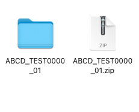
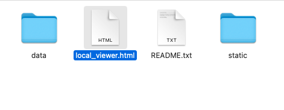
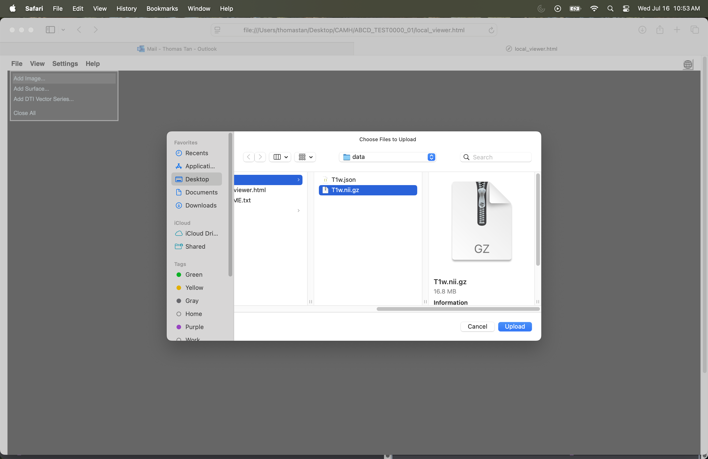

This zip was created on rep_create_date.

⚠️ Reminder: must unzip the archive before opening local_viewer.html

It contains data collected as part of the 'rep_study_name' at CAMH (PI: rep_pi_name).
We have included NIfTI (.nii.gz) files for T1, for an MRI conducted at CAMH on rep_scan_date.

## Viewing NIfTI Files

To view NIfTI files using the included local viewer:

1. Unzip the zip file 

2. Open [`local_viewer.html`](./local_viewer.html) from the unzipped folder in your preferred web browser.

3. In the viewer, go to **File → Add Image...** and select a T1w.nii.gz file from the `data/` directory inside the unzipped folder.

4. To load a different image, first go to **File → Close All**, then repeat step 2.

Notes
- A screenshot of the viewer interface is located in `images/image1.png`. Open it separately if needed.
- All image headers have been cleaned but images have NOT been de-faced.

PIs contact: 
rep_pi_email

lab email address: 
rep_lab_email

